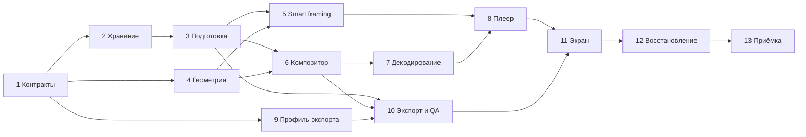

> Integration amendment (2026-10-10): the approved common HybridProject core from PR #15 owns project/asset IDs, revision allocation, ProjectClock, clip span/sourceMap, storage and commands. Task 1 now supplies format/framing values and a read-only DraftProject snapshot adapter. Task 2 storage work is delegated to that core owner; preparation, export and lifecycle tasks consume the common store through the adapter. Independent geometry/render tasks continue. See docs/design/live-preview-core-contract.md. The original task history below is preserved; competing draft stores/codecs and private revision allocators are superseded.

# План реализации быстрого предпросмотра и форматов кадра

> **For agentic workers:** REQUIRED SUB-SKILL: Use superpowers:subagent-driven-development (recommended) or superpowers:executing-plans to implement this plan task-by-task. Steps use checkbox (`- [ ]`) syntax for tracking.

**Goal:** Пользователь смотрит автоматически собранный черновик с музыкой, перематывает его, выбирает формат и кадрирование и экспортирует просмотренную версию.

**Architecture:** Подготовка сохраняет граф и семантические данные до кодирования. Один план кадров, одна геометрия и один GLES-композитор обслуживают Surface предпросмотра и Surface энкодера. EditSession владеет подготовкой и экспортом, а контроллер просмотра — декодерами, музыкальными часами и поколениями запросов.

**Tech Stack:** Kotlin, существующий Android View/XML UI, LiveData, Executor/Handler, MediaCodec, MediaExtractor, MediaPlayer, SurfaceView, EGL/GLES 2, существующий локальный ML-анализ, JUnit 4 и Espresso. Сохраняются minSdk 26, compileSdk/targetSdk 36 и пакет com.veycad.app. Новые сетевые сервисы, Media3 и Compose для этой задачи не требуются.

**Spec:** [Утверждённая спецификация](../specs/2026-10-10-live-preview-aspect-ratios-design.md). Пользователь подтвердил её 10 октября 2026 года. Этот план предназначен для ревью до реализации.

Основа: удалённая main `a0395e26b93463f91520181a2eeb09dfd05e78a3`, спецификация `f8dc36deed9ab718d2cb3cb9bbb955fdcbb69b32` из [PR #16](https://github.com/Veycad/Veycad/pull/16). Перед выполнением сверить базу и применимые AGENTS.md/CONTRIBUTING.md. Изменения в исходном грязном checkout не являются частью плана.

## Global Constraints

- Первая версия сохраняет один активный черновик. Новый черновик заменяет предыдущий только после явного запуска нового монтажа пользователем и успешного атомарного сохранения нового состояния.
- Формат — настройка конкретного проекта, качество — настройка экспорта. Ориентация камеры не выбирает выходной формат автоматически.
- Первоначальный формат для FEAR — 1:1, для Heartbeat и DUALITY — 9:16. После явного выбора пользователя смена стиля сохраняет этот выбор.
- Для каждого режима кадрирования параметры сохраняются отдельно по исходнику и формату. Режим применяется ко всем вхождениям исходника, без редактора отдельных клипов.
- Первоначальный режим — «Вручную» с центральным crop и масштабом 1. Zoom от 1 до 3; центр ограничен исходником.
- При потере надёжной маски до 500 мс сохраняется последний устойчивый центр; затем возврат к центру за 300 мс; восстановление движения за 300 мс. Время — source PTS.
- Базовый размер вывода имеет короткую сторону 360 px: 360 × 640, 640 × 360, 360 × 360 или 360 × 450. При достаточном запасе — 540 px.
- Предпросмотр выполняет до 30 показов в секунду. Heartbeat экспортируется в 60 FPS, остальные доступные рецепты — в 30 FPS. Остановленный кадр берётся с общей экспортной сетки.
- Для переходов разрешены максимум два активных видеодекодера. Недостающий необходимый слой означает загрузку, а не упрощение эффекта.
- Суммарный дополнительный бюджет приложения для кэша предпросмотра, миниатюр и FBO — 32 MiB. Внутренние буферы MediaCodec измеряются отдельно.
- Полный MP4 создаётся после нажатия «Экспортировать». Подготовка и просмотр не создают encoder, muxer или итоговый MP4.
- Экспорт фиксирует revision, граф, семантические данные, формат, кадрирование и профиль вывода. QA не заменяет просмотренную версию другим кандидатом.
- Доступны Heartbeat, FEAR и DUALITY; Sigma остаётся заблокированной. Выбор личности в группе, перестановка склеек, ключевые кадры, новые HDR-возможности и обязательное перекодирование proxy-исходников не входят в первую версию.

| Формат | 720p | 1080p | 4K при подтверждённой поддержке |
| --- | --- | --- | --- |
| 9:16 | 720 × 1280 | 1080 × 1920 | 2160 × 3840 |
| 16:9 | 1280 × 720 | 1920 × 1080 | 3840 × 2160 |
| 1:1 | 720 × 720 | 1080 × 1080 | 2160 × 2160 |
| 4:5 | 720 × 900 | 1080 × 1350 | 2160 × 2700 |

## Review Focus

Каждый риск ниже закреплён тестом в указанной задаче.

1. Два разных исходника с одинаковым PTS: маска, лицо, flow и crop должны принадлежать своему source ID, включая вторичный временной слой — задачи 3 и 7.
2. Перезапуск между записью семантического blob и заменой манифеста: старый проект должен остаться целым; cleanup не удаляет удерживаемый исходник — задачи 2 и 12.
3. Быстрый seek одновременно со сменой формата и потерей Surface: старый callback не рисует и не запускает музыку — задача 8.
4. Несколько людей или неизвестный faceCount в старом анализе: режим не изображает отслеживание выбранной личности — задача 5.
5. Формат 4:5 или 4K, который codec заявляет, но не запускает: точный размер недоступен с объяснением; опубликованный MP4 не подменяется меньшим — задачи 9 и 11.

## Файлы и ответственность

Все Kotlin-файлы ниже имеют package `com.veycad.app`. Для читаемости используются сокращения путей; это буквальные префиксы, а не новые каталоги:

- `M/` = `app/src/main/java/com/example/autoedit/`.
- `T/` = `app/src/test/java/com/example/autoedit/`.
- `A/` = `app/src/androidTest/java/com/example/autoedit/`.
- `U/` = `app/src/uiTest/java/com/example/autoedit/`.
- `L/` = `app/src/main/res/layout/`; `R/` = `app/src/main/res/values/`.

| Новые файлы | Ответственность |
| --- | --- |
| M/ProjectFormat.kt, M/DraftProject.kt | Форматы, качество, устойчивые ID, настройки и версия черновика |
| M/DraftProjectCodec.kt, M/DraftProjectStore.kt | Полный round trip графа и атомарный манифест одного активного проекта |
| M/DraftAssetStore.kt | Версионированные семантические blobs и leases источников, музыки и данных |
| M/DraftPreparation.kt | Анализ и режиссура без кодирования |
| M/CompositionFramePlan.kt | Набор необходимых слоёв на точном output PTS поверх существующего расписания |
| M/FramingPlan.kt, M/SmartFramingTrack.kt | Общая геометрия fit/crop и детерминированная дорожка центра |
| M/RenderTarget.kt, M/EglRenderTarget.kt, M/GlesFrameCompositor.kt | Разделение Surface/EGL и композиции, извлечённой из GlSession |
| M/VideoDecoderPool.kt, M/PreviewMemoryBudget.kt | Два переиспользуемых декодера, точный seek и ограниченная память |
| M/DraftPreviewController.kt, M/PreviewAudioClock.kt, M/PreviewSeekQueue.kt | Проигрывание, музыка, поколения и отмена |
| M/ExportProfileResolver.kt, M/EncoderCapabilityProbe.kt | Точные размеры, bitrate и проверка запуска 4K |
| M/DraftExportEngine.kt | Рендер и QA неизменяемого снимка |
| M/DraftPreviewScreen.kt, M/DraftTimelineView.kt, L/view_draft_preview.xml, R/preview_strings.xml | Новый экран, таймлайн и доступные пользователю действия |
| M/PreviewMetrics.kt | Локальные измерения задержек, PTS, памяти и пропусков |

Существующие файлы меняются только в задачах, которым это необходимо. В частности, `HighQualityFramePlan.kt` остаётся источником тайминга, `MediaCodecSpeedRampRenderer.kt` — владельцем encoder/muxer, а старый VideoView продолжает воспроизводить готовые файлы. Не переносить весь MainActivity или все шейдеры в новую архитектуру одновременно.

## Порядок и проверки

Это одна связанная функция с общими данными и графическим выводом. Задачи имеют отдельные проверяемые результаты, но не являются независимыми продуктовыми подсистемами. Граница PR — одна задача с необходимыми тестами; следующий PR опирается на проверенный предыдущий. До задачи 13 новый продуктовый маршрут доступен только в debug/uiTest через `DraftFeatureGate.isEnabled(): Boolean`; production возвращает false. Файл M/DraftFeatureGate.kt создаётся в задаче 11, переключение — в задаче 13.

Команды выполняются из корня конкретного worktree. Для каждого RED/ GREEN ниже запускается одна и та же указанная команда; RED должен отражать новое поведение, а не неисправную среду. Общий JVM-шаблон: `.\gradlew.bat :app:testDebugUnitTest --tests 'com.veycad.app.<Class>'`. Instrumentation-шаблон: `.\gradlew.bat :app:connectedUiTestAndroidTest '-Pandroid.testInstrumentationRunnerArguments.class=com.veycad.app.<Class>'` на выделенном `.uitest` устройстве. Удаление данных основной установленной версии запрещено.

Перед каждым коммитом: добавить только Files этой задачи, просмотреть `git diff --cached`, выполнить `git diff --cached --check`, затем коммит с указанным заголовком. Перед PR выполнить `.\gradlew.bat clean baselineVerify` и применимые UI/device-проверки. В PR сохранить фактические команды, результаты и ограничения, включая состояние визуальной приёмки. Слияние — только по явному решению владельца.

### Задача 1 Контракт проекта и форматов

**Files:** создать M/ProjectFormat.kt, M/DraftProject.kt; тесты T/ProjectFormatTest.kt, T/DraftProjectTest.kt, T/PreviewTestFixtures.kt.

**Interfaces:**

- `enum class ProjectAspect { PORTRAIT_9_16, LANDSCAPE_16_9, SQUARE_1_1, FEED_4_5 }`, `enum class ExportQuality(val shortEdge: Int) { P720(720), P1080(1080), K4(2160) }`, `data class OutputSize(val width: Int, val height: Int)`.
- `ProjectAspect.size(shortEdge: Int): OutputSize`; `ProjectFormats.defaultFor(recipe: MontageStyleCatalog.Recipe): ProjectAspect`.
- `data class SourceId(val value: String)`, `data class SourceGeometry(val encodedWidth: Int, val encodedHeight: Int, val rotation: Int, val pixelAspectRatio: Float)`; `DraftSource(id: SourceId, sha256: String, relativePath: String, ownership: SourceOwnership, name: String, durationUs: Long, geometry: SourceGeometry)`, `SourceOwnership { IMPORTED, CAPTURE }`. `DraftMusicAsset(id: String, relativePath: String, sha256: String)` хранит выбранную музыку.
- `enum class FramingMode { MANUAL, SMART_PERSON, BLURRED_FIT }`; `data class FramingSettings(val mode: FramingMode, val centerX: Float = .5f, val centerY: Float = .5f, val zoom: Float = 1f)`; `data class FramingKey(val sourceId: SourceId, val aspect: ProjectAspect)`. `SourceFramingSettings` хранит текущий mode и отдельные FramingSettings каждого режима, не теряя manual при смене mode.
- `DraftVersion(projectId: String, revision: Long)` обозначает CAS-версию; `DraftProject`: schemaVersion=1, projectId, revision, recipe, generatorVersion, aspect, aspectExplicitlySelected, fps, sources в порядке sourceIndex, musicAsset (ID/path/hash), graph, `Map<FramingKey, SourceFramingSettings>`, `Map<SourceId, String>` semanticAssetIds, `CaptureOrigin?`, savedOutputTimeUs. `CaptureOrigin(sessionId: String, takeOrdinal: Int, recommended: Boolean)`.
- `DraftProject.withAspect(aspect: ProjectAspect, explicit: Boolean = true): DraftProject`; `withFraming(key: FramingKey, settings: SourceFramingSettings): DraftProject`. Изменение композиции повышает revision и metadata.revision графа, но не меняет клипы. Recipe/музыка готового DraftProject неизменны: смена стиля запускает новую подготовку. `ProjectFormats.forRecipe(recipe: MontageStyleCatalog.Recipe, current: ProjectFormatSelection): ProjectFormatSelection` получает `ProjectFormatSelection(aspect: ProjectAspect, explicitlySelected: Boolean)` и сохраняет явный выбор при новой подготовке.
- T/PreviewTestFixtures.kt: `graph(recipe: MontageStyleCatalog.Recipe, sourceCount: Int = 1): MontageGraph`, `project(recipe: MontageStyleCatalog.Recipe = HEARTBEAT): DraftProject`; маленькие валидные графы с переходом и parameter track, без Android.

- [ ] **1. RED:** ProjectFormatTest проверяет все 12 пар из таблицы: `assertEquals(OutputSize(1080, 1350), FEED_4_5.size(1080))`; DraftProjectTest проверяет `defaults_fear_square_others_portrait`, `explicit_format_survives_recipe_change`, `settings_round_trip_between_aspects_and_modes`, `revision_changes_without_redirection`, `rejects_invalid_zoom_nan_and_source_index` с `assertEquals(3f, restoredManual.zoom)` и неизменностью `graph.clips`.
- [ ] **2. Запустить RED:** JVM-шаблон с `ProjectFormatTest` и `DraftProjectTest`; ожидается падение новых assertions/отсутствие новых API.
- [ ] **3. Реализовать перечисленные типы и методы**, валидировать конечные числа, ID, sourceIndex, FPS и диапазоны, отказаться от mutable Android-объектов в модели. В ProjectFormats.forRecipe без явного aspect вернуть default нового recipe; при explicitlySelected=true сохранить aspect, даже если он совпадал со старым default. Новый projectId назначать новой подготовке; withAspect/withFraming не изменяют projectId.
- [ ] **4. GREEN:** повторить обе команды; все новые tests PASS.
- [ ] **5. Коммит:** `feat(render): добавить контракт черновика и форматов`.

### Задача 2 Атомарное хранение и удержание исходников

**Files:** создать M/DraftProjectCodec.kt, M/DraftProjectStore.kt, M/DraftAssetStore.kt; изменить M/RenderWorkspace.kt, M/CaptureSessionStore.kt; тесты T/DraftProjectStoreTest.kt, T/DraftAssetStoreTest.kt, T/RenderWorkspaceTest.kt.

**Interfaces:**

- `DraftProjectCodec.encode(project: DraftProject): ByteArray`; `decode(bytes: ByteArray): DraftProject`. Использовать версионированный DataInput/OutputStream-контракт по образцу MediaFrameAnalysisCache; не Java serialization. Полный граф включает clips/transforms/speed curves, overlays, metadata, parameterTracks, effectGraph, audioTrack. Плоскости исключены из манифеста; графовые frameAttachments/refinements восстанавливаются из semantic blobs. Codec round trip сравнивает граф без плоскостей; Ready содержит компактный граф без плоскостей; данные всех источников разрешаются через semanticAssetIds. Полные массивы не загружаются в граф при открытии плеера.
- `sealed interface DraftLoadResult`: `Ready(project: DraftProject)`, `NeedsPreparation(project: DraftProject, missingAssetIds: List<String>)`, `MissingSources(sourceIds: List<SourceId>)`, `UnsupportedSchema(version: Int)`, `UnsupportedGenerator(version: String)`, `Corrupt(message: String)`, `Empty`.
- `DraftProjectStore(filesDir: File, assets: DraftAssetStore)`: `loadActive(): DraftLoadResult`, `saveActive(project: DraftProject, expectedVersion: DraftVersion?): Unit`, `savePosition(projectId: String, outputTimeUs: Long): Unit`, `freeze(projectId: String, revision: Long): DraftSnapshot`.
- `DraftSnapshot : AutoCloseable` содержит `project: DraftProject`, `contentHash: String`, `assets: DraftAssetStore.Lease`; close освобождает lease. `DraftAssetStore` предоставляет `importSource(file: File, sourceId: SourceId): File`, `writeSemantic(sourceId: SourceId, asset: DraftSemanticAsset): String`, `readSemantic(assetId: String): DraftSemanticAsset`, `lease(project: DraftProject): Lease`, `prune(): Unit`.

- `DraftSemanticAsset(analysis: MediaFrameVisualAnalyzer.Result, renderAttachments: FrameAttachmentTimeline)` хранит как исходный анализ, так и точные maskRefinements после подготовки. Blob имеет версию, SHA-256 и SourceId, компактный индекс отсчётов и отдельно адресуемые plane chunks; исходный analysis cache не заменяет уточнённые маски. `DraftAssetStore.openSemantic(assetId: String): DraftSemanticReader`; reader предоставляет `sampleAt(sourceTimeUs: Long): FrameAttachments?`, `requiredBytes(sourceTimeUs: Long): Long`, `close(): Unit`. Для плеера читать только соседние chunks, а не полный gzip-анализ; readSemantic используется при подготовке/проверке полного round trip. Interpolation сохраняет существующий приоритет maskRefinements и отдельную шкалу depth/flow. `DraftProjectStore.FileOps` содержит `writeAndSync(file: File, bytes: ByteArray): Unit`, `atomicReplace(source: File, target: File): Unit` для fault injection в tests.

- [ ] **1. RED:** `graph_round_trip_preserves_all_tracks` сравнивает graph и внешний attachments по содержимому; `crash_before_manifest_replace_keeps_previous_revision` — `assertEquals(old.revision, store.loadActive().project.revision)`; `stale_revision_write_is_rejected`; `missing_changed_source_blocks_restore`; `semantic_missing_requests_preparation`; `future_schema_is_explicit`. DraftAssetStoreTest: `cleanup_preserves_active_project_and_export_lease`, `capture_take_is_referenced_without_copying_other_takes`, `partial_blob_is_never_referenced`.
- [ ] **2. Запустить RED:** JVM-шаблон с `DraftProjectStoreTest`, `DraftAssetStoreTest`, `RenderWorkspaceTest`.
- [ ] **3. Реализовать store/codec/assets**: `filesDir/drafts/<projectId>/manifest.bin`, `active-draft` как атомарно заменяемый указатель, source/semantic/music assets вне Android cacheDir. Запись blobs и fsync предшествует манифесту и указателю; сбой оставляет старый указатель. Ограничить длины коллекций и размеры при чтении; не читать произвольные абсолютные/выходящие за store пути из файла. Проверять fingerprint источника при восстановлении и перед freeze на worker. Отдельная запись позиции не меняет composition revision. CAS expectedVersion сравнивает projectId и revision активного указателя; null допустим только при пустом store. Замена новым проектом передаёт версию прежнего активного проекта. Это защищает и завершённые правки, и поздний callback другого проекта с тем же номером revision. Prune удаляет старый проект и неиспользуемые assets после снятия leases; semantic cache удерживает не более трёх завершённых неиспользуемых анализов, по текущему правилу, а активные ссылки защищает lease.
- [ ] **4. GREEN:** повторить три команды, включая ошибки записи через внедряемую файловую операцию `DraftProjectStore.FileOps`; затем проверить реальный rename на устройстве в задаче 12.
- [ ] **5. Коммит:** `feat(storage): сохранять черновик и удерживать его данные`.

### Задача 3 Подготовка без encoder и общий план слоёв

**Files:** создать M/DraftPreparation.kt, M/CompositionFramePlan.kt; изменить M/VeycadAutomaticEditor.kt:99–272,419–439, M/HighQualityFramePlan.kt:43–124, M/FrameAttachments.kt, M/LiveDecoderTransitionPlan.kt, M/VideoDisplayOrientation.kt; тесты T/DraftPreparationTest.kt, T/CompositionFramePlanTest.kt, T/VeycadEngineCoreTest.kt.

**Interfaces:**

- `DraftPreparation.Request(context: Context, sourceFiles: List<File>, musicFile: File, recipe: MontageStyleCatalog.Recipe, aspect: ProjectAspect, aspectExplicitlySelected: Boolean, captureOrigin: CaptureOrigin?, checkCancelled: () -> Unit, onProgress: (VeycadAutomaticEditor.Progress) -> Unit)`.
- `DraftPreparation.prepare(request: Request): DraftProject`; результат атомарно сохраняется через задачу 2. Добавить Stage.PREPARING_EFFECTS; материал/аудио/каталог проходят существующие gates.
- Внедряемые `DraftPreparation.Dependencies`: `analyze(file: File, profile: SourceAnalysisProfile): MediaFrameVisualAnalyzer.Result`, `direct(request: Request, analyses: List<MediaFrameVisualAnalyzer.Result>): MontageGraph`, `refine(request: Request, graph: MontageGraph, sources: List<DraftSource>, analyses: List<MediaFrameVisualAnalyzer.Result>): Map<SourceId, FrameAttachmentTimeline>`, `save(project: DraftProject): Unit`; типы параметров — Request/List<MediaFrameVisualAnalyzer.Result>. Production использует существующие анализаторы/директоры; JVM spies проверяют порядок.
- `CompositionFramePlan.build(project: DraftProject, attachmentsAt: (SourceId, Long) -> FrameAttachments?): Plan`; `Plan.frameAt(outputTimeUs: Long): Frame`, `displayFrames(maxFps: Int = 30): Sequence<Frame>`. Plan хранит canonical `HighQualityFramePlan.Plan`, построенный на graph.copy(frameAttachments = FrameAttachmentTimeline()). Он не содержит копий ML-плоскостей на каждый выходной кадр; FrameAt разрешает только текущие слои через attachmentsAt из DraftSemanticReader. displayFrames — ленивый sequence. Кадры выбираются из него, а не пересчитываются в 30 FPS. frameAt выбирает ближайший canonical index по round(outputTimeUs×fps/1_000_000), ограниченный 0…lastIndex; граница durationUs возвращает последний кадр. displayFrames(30) берёт все кадры 30 FPS или каждый второй из 60 FPS.
- `Frame(outputTimeUs: Long, primary: Layer, outgoing: Layer?, temporal: Layer?, scheduled: HighQualityFramePlan.Frame)`; `Layer(sourceId: SourceId, sourceTimeUs: Long, attachments: FrameAttachments?)`. Добавить secondarySourceIndex в HighQualityFramePlan.Frame вместе с secondarySourceTimeUs; учитывать sourceIndex исходного вторичного timeline-role. Привязка attachments делается по SourceId каждого слоя, включая outgoing, из renderAttachments соответствующего DraftSemanticAsset. Временные overlay PTS используют общий helper из текущего temporalLayerSourceTimeUs, в том числе offset и timeline-role; оставшийся renderer helper становится адаптером.
- `VideoDisplayOrientation.geometryForFile(file: File): SourceGeometry` извлекает metadata/SAR для источников нового проекта на worker.

- [ ] **1. RED:** `prepare_calls_analysis_direction_refinement_and_save_only` — `assertEquals(listOf("analyze", "direct", "refine", "save"), calls)`; `cancellation_before_save_keeps_previous_draft`; `capture_selected_take_is_preserved`; `canonical_plan_does_not_duplicate_semantic_planes`; `two_sources_same_pts_get_distinct_masks` — `assertNotEquals(frame.primary.attachments, frame.temporal!!.attachments)`; `sixty_fps_preview_is_subset_and_seek_can_select_odd_frame` — paused frame at 16_667us существует и не зависит от displayFrames(30). Проверить ±1 canonical frame вокруг каждой склейки, speed curve и выходного EOS.
- [ ] **2. Запустить RED:** JVM-шаблон с `DraftPreparationTest`, `CompositionFramePlanTest`, `VeycadEngineCoreTest`.
- [ ] **3. Извлечь анализ/режиссуру/prepareExactMattes из VeycadAutomaticEditor** без изменения алгоритмов выбора материала. В точном пути подготовить необходимые mattes всех источников до READY; обычная graph.frameAttachments не становится анализом второго источника. Результат доступных рецептов — один граф плюс Map<SourceId, FrameAttachmentTimeline> точных семантических данных. Записать DraftSemanticAsset с исходным анализом и уточнёнными плоскостями каждого источника; maskRefinements не теряются после перезапуска. SourceId и DraftSource назначаются до Dependencies.refine и сохраняют порядок файлов. После save закрыть анализаторы и освободить полные analysis/plane buffers; новый DraftProject содержит ссылки, не их дубликаты. Старый `render(Request)` остаётся регрессионным адаптером. Build композиции использует HighQualityFramePlan и LiveDecoderTransitionPlan, включая существующее правило первого удержанного кадра перехода: одинаковое для обоих выводов, а не скрытая поправка энкодера.
- [ ] **4. GREEN:** повторить JVM-команды; дополнительно в A/DraftPreparationDeviceTest.kt с реальным prepare подтвердить нулевой счётчик созданных encoder/muxer и отсутствие MP4 в output scratch. Запуск — instrumentation-шаблон с `DraftPreparationDeviceTest`; fixture — пригодный синтетический источник с внедрённой детерминированной семантикой, реальная запись store.
- [ ] **5. Коммит:** `refactor(render): отделить подготовку от кодирования`.

### Задача 4 Общая геометрия и ручное кадрирование

**Files:** создать M/FramingPlan.kt; изменить M/SourceFraming.kt, M/VideoDisplayOrientation.kt; тесты T/FramingPlanTest.kt, T/SourceFramingTest.kt.

**Interfaces:**

- `data class NormalizedRect(val left: Float, val top: Float, val right: Float, val bottom: Float)`.
- `FramingPlan.Sample(foregroundSource: NormalizedRect, foregroundDestination: NormalizedRect, backgroundSource: NormalizedRect?, blurRadiusFraction: Float)`; source/destination — нормализованные координаты ориентированного источника/проекта.
- `FramingPlan.sample(geometry: SourceGeometry, aspect: ProjectAspect, settings: FramingSettings): Sample`; `clampManual(geometry: SourceGeometry, aspect: ProjectAspect, settings: FramingSettings): FramingSettings`; `mapPlane(plane: FrameAttachments.Plane, sample: Sample, foregroundOnly: Boolean = true): FrameAttachments.Plane`.

- [ ] **1. RED:** `portrait_crop_of_landscape_is_centered` — `assertEquals(.31640625f, sample.foregroundSource.right - sample.foregroundSource.left, 1e-6f)` для 1920×1080 → 9:16; `manual_zoom_and_pan_never_leave_source`; `blur_foreground_fits_entire_frame` — `assertEquals(NormalizedRect(0f,0f,1f,1f), sample.foregroundSource)`; `rotation_and_sar_are_applied_once`. Параметризовать четыре source-aspect, четыре project-aspect, три mode и rotation 0/90/180/270 с SAR 1 и 4/3; SMART пока получает подготовленный центр как manual geometry.
- [ ] **2. Запустить RED:** JVM-шаблон с `FramingPlanTest` и `SourceFramingTest`.
- [ ] **3. Реализовать FramingPlan** с центрированием/zoom относительно fill, ограничением окна и fit-destination. Сохранить `SourceFraming.crop(...)` как адаптер legacy центрального crop; новые потребители используют Sample. Metadata rotation определяет display-aspect, MediaCodec/SurfaceTexture — декодированные UV; второе вращение GL не добавлять. Для blur назначить фиксированные параметры первого выпуска: двухпроходное separable Gaussian, sigma=0.02 короткой стороны проекта, half-resolution фон, radius=ceil(3*sigma), без пользовательской регулировки.
- [ ] **4. GREEN:** повторить обе команды; проверить mapPlane и контрольные corners отдельно от цветовых текстур, с нечётными размерами исходника.
- [ ] **5. Коммит:** `feat(render): добавить геометрию формата и ручного кадра`.

### Задача 5 Семантическая дорожка автокадрирования

**Files:** создать M/SmartFramingTrack.kt; изменить M/LocalSemanticFrameAnalyzer.kt:24–39,127–151, M/VisualEventMap.kt:126–147, M/MediaFrameVisualAnalyzer.kt, M/FrameAttachments.kt, M/MediaFrameAnalysisCache.kt, M/DraftPreparation.kt, M/DraftAssetStore.kt; тесты T/SmartFramingTrackTest.kt, T/MediaFrameAnalysisCacheTest.kt, A/SemanticFaceCountDeviceTest.kt.

**Interfaces:**

- В Result, Observation и сохраняемый семантический отсчёт добавить `detectedFaceCount: Int?`; успех face inference хранить отдельно. При успешной детекции count — число всех лиц, крупнейшее лицо остаётся текущим faceRegion. null означает неизвестно. Версию MediaFrameAnalysisCache поднять с 18 до 19; semantic blob version — 2.
- `enum class SmartFramingStatus { TRACKING, HOLDING, NO_PERSON, AMBIGUOUS, UNKNOWN }`; `SmartFramingTrack.Point(sourceTimeUs: Long, centerX: Float, centerY: Float, status: SmartFramingStatus)`.
- `SmartFramingTrack.build(analysis: MediaFrameVisualAnalyzer.Result, sourceWindows: List<VisualEventMap.UsableWindow>): SmartFramingTrack`; `sample(sourceTimeUs: Long): Point`. В задаче 5 расширить DraftSemanticAsset полем `smartTrack: SmartFramingTrack? = null`; Track сохраняется в компактном заголовке semantic blob, reader получает `smartTrack(): SmartFramingTrack?`; ключ зависит от source hash/analysis version/generator version, не от порядка seek.
- Начальное правило неоднозначности mask: после порога alpha≥0.5 две 4-связные компоненты, каждая ≥15% площади всех foreground pixels и с расстоянием центров ≥0.20, дают AMBIGUOUS. При detectedFaceCount=null использовать центр со статусом UNKNOWN; это не NO_PERSON. Порог требует device/visual проверки вместе с параметрами сглаживания.

- [ ] **1. RED:** `same_pts_after_forward_and_backward_seek_has_same_center` — `assertEquals(track.sample(t), restoredTrack.sample(t))`; `loss_holds_500ms_then_centers_in_300ms`; `recovery_blends_for_300ms`; `multiple_faces_use_center_not_last_person`; `null_face_count_is_unknown_not_zero`; `single_outlier_is_rejected`; `no_interpolation_through_omitted_source_window`; `cache_round_trip_retains_count_and_inference_failure`.
- [ ] **2. Запустить RED:** JVM-шаблон с `SmartFramingTrackTest` и `MediaFrameAnalysisCacheTest`.
- [ ] **3. Реализовать предварительное построение дорожки**: взвешенный центр mask и bounds; начальные пороги confidence≥0.6, subjectQuality≥0.6, subjectOcclusion≤0.35, coverage 0.02…0.85. Одноточечный скачок центра >0.20 отбрасывать, если соседние надёжные точки не подтверждают новую позицию с допуском 0.08. Сгладить надёжные центры двухпроходным EMA с tau=300ms по source PTS внутри связного окна. Это параметры первой реализации, подлежащие визуальному ревью, не новые измеренные гарантии. FaceCount>1/неоднозначная маска дают AMBIGUOUS и центр; null не объявлять единственным человеком. Интервалы hold/return/recovery задаются спецификацией. Несмежные окна разделить, без движения через пропущенный участок; одинаковый source PTS остаётся детерминированным. Центр ограничивает FramingPlan задачи 4.
- [ ] **4. GREEN:** повторить JVM-команды; instrumentation-шаблон с `SemanticFaceCountDeviceTest` на локальных fixtures: 0/1/2 лица и ошибка ML возвращают соответственно 0/1/2/null; ошибка не превращается в NO_PERSON. Подготовка сохраняет track до READY.
- [ ] **5. Коммит:** `feat(analysis): подготовить детерминированное автокадрирование`.

### Задача 6 Общий GLES-композитор для экрана и энкодера

**Files:** создать M/RenderTarget.kt, M/EglRenderTarget.kt, M/GlesFrameCompositor.kt; изменить M/MediaCodecSpeedRampRenderer.kt:85–225,552–конец GlSession, M/AuthoredTitleProfile.kt, M/RenderPassPlanner.kt; тесты A/GlesFrameCompositorDeviceTest.kt, A/GlProgramLifecycleTest.kt, T/RenderPassPlannerTest.kt.

**Interfaces:**

- `interface RenderTarget : AutoCloseable { val size: OutputSize; fun makeCurrent(); fun resize(size: OutputSize); fun present(outputTimeUs: Long) }`; `EglRenderTarget.forDisplay(surface: Surface, size: OutputSize): RenderTarget`, `forEncoder(surface: Surface, size: OutputSize): RenderTarget`. Size обозначает разрешение композиции; display target масштабирует её в текущий Surface без изменения aspect.
- `GlesFrameCompositor(target: RenderTarget, graph: MontageGraph, projectAspect: ProjectAspect, passPlan: RenderPassPlanner.Plan, framings: Map<FramingKey, SourceFramingSettings>, geometries: Map<SourceId, SourceGeometry>, smartTracks: Map<SourceId, SmartFramingTrack>, onPassExecuted: (RenderPassPlanner.PassKind) -> Unit)`; `decoderSurface(slot: Int): Surface`, `awaitTexture(slot: Int, checkCancelled: () -> Unit): Unit`, `draw(frame: CompositionFramePlan.Frame): Unit`, `close(): Unit`.
- Compositor владеет входными SurfaceTexture, шейдерами и FBO на одном GL worker. Добавить `updateFraming(project: DraftProject): Unit`, `resize(size: OutputSize): Unit`: они заменяют настройки/FBO, сохраняя EGL context и текущие входные текстуры при живом Surface. RenderTarget владеет EGL и способом present; encoder target ставит presentation timestamp, display target только показывает. Inspector подключается callback, не обязателен для просмотра.

- [ ] **1. RED:** `same_frame_draws_same_composition_on_display_and_encoder` сравнивает corner markers, foreground bounds, PTS и выполненные pass IDs; `blur_foreground_and_background_use_same_source_pts`; `each_layer_projects_its_own_mask_depth_flow_face`; `flow_vectors_transform_direction_and_scale_with_source_geometry`; `surface_texture_rotation_is_not_applied_twice`; `failure_releases_all_programs_targets_and_surfaces`. Для 1× visual parity пока использовать 720p baseline; матрица четырёх форматов — задача 13.
- [ ] **2. Запустить RED:** instrumentation-шаблон с `GlesFrameCompositorDeviceTest`, `GlProgramLifecycleTest`; JVM-шаблон с `RenderPassPlannerTest`.
- [ ] **3. Извлечь GlSession без переписывания художественных шейдеров**; decoder inputs и source framing перед clip transform, затем transitions/layers, эффекты/title, target. Добавить fit-background проход задачи 4. Пространственные параметры (title textSizePx, blur radius, pivots) нормализовать относительно исходного авторского размера профиля, а не фактической ширины preview; плотность Android UI не участвует. Recordable EGL выбирать только для encoder. Encoder/muxer остаются внутри MediaCodecSpeedRampRenderer. Legacy path оборачивает центральный crop и общий compositor; сохраняет прежние dimensions/QA для регрессии.
- [ ] **4. GREEN:** повторить команды; экспортировать прежние Heartbeat/FEAR/DUALITY в legacy размерах, проверить inspector pass counts и MP4, визуально сравнить 1×. Любая потеря эффекта блокирует продолжение к продуктовому экрану.
- [ ] **5. Коммит:** `refactor(render): использовать общий GLES-композитор`.

### Задача 7 Точное декодирование с двумя слотами и ограниченным кэшем

**Files:** создать M/VideoDecoderPool.kt, M/PreviewMemoryBudget.kt; извлечь DecoderSession/DecoderCursor из M/MediaCodecSpeedRampRenderer.kt:375–519; изменить M/GlesFrameCompositor.kt; тесты T/PreviewMemoryBudgetTest.kt, A/VideoDecoderPoolDeviceTest.kt.

**Interfaces:**

- `VideoDecoderPool(sources: List<File>, compositor: GlesFrameCompositor, checkCancelled: () -> Unit)`; `prepare(frame: CompositionFramePlan.Frame): Unit`, `reset(): Unit`, `close(): Unit`; максимум два codec slots. `DecodedLayerKey(sourceId: SourceId, sourceTimeUs: Long, analysisAssetId: String, size: OutputSize)`.
- `PreviewMemoryBudget(limitBytes: Long = 32L * 1024 * 1024)`: `reserve(key: String, bytes: Long, evict: () -> Unit): Boolean`, `release(key: String): Unit`, `clear(): Unit`, `usedBytes: Long`. Отдельные scene/retained/FBO/thumbnail ресурсы и текущие decoded semantic chunks регистрируются до allocation. Это общий budget на весь preview, а не отдельный лимит каждого reader/источника.

- [ ] **1. RED:** `backward_seek_decodes_from_previous_sync_to_requested_pts`, `first_gop_frame_is_not_exact_seek`, `mixed_orientation_two_source_transition_uses_two_slots`, `third_temporal_layer_is_prepared_serially_without_dropping_effect`, `eos_retains_last_valid_source_frame`, `cancel_during_decode_unwinds_pool`. Budget test: `assertTrue(budget.usedBytes <= 33_554_432L)` после 10_000 запросов; исключённые/освобождённые resources больше не используются.
- [ ] **2. Запустить RED:** JVM-шаблон с `PreviewMemoryBudgetTest`; instrumentation-шаблон с `VideoDecoderPoolDeviceTest`.
- [ ] **3. Реализовать pool**, переиспользуя текущую стратегию previous-sync + decode-forward и выбор первого доступного кадра source PTS≥target (при EOS — последний валидный). При обратном seek flush/beginRange; cancellation проверять после каждой dequeue/queue/update, ожидания ограничены. Третий требуемый слой сначала сохранять как уменьшенную preview-текстуру, освобождая slot для следующего; export получает полный размер отдельно. В RAM не держать всю историю полноразмерных Bitmap. Регистрация FBO/copy/thumbnail и requiredBytes семантических отсчётов в общем budget, LRU eviction только неиспользуемых текстур на GL worker. Prefetch соседней склейки — низкий приоритет и тот же budget; frame key включает revision, aspect, framing и output PTS. Не сохранять глобальный мутируемый OES как снимок старого кадра.
- [ ] **4. GREEN:** повторить команды на H.264 30/60 FPS, GOP≤2s; отдельные HEVC/4K/long-GOP fixtures могут показать превышение target и остаются в отчёте. Проверить, что decode cancellation не ждёт полного длинного GOP.
- [ ] **5. Коммит:** `feat(render): добавить точный seek и ограниченный пул декодеров`.

### Задача 8 Плеер музыка и поколения запросов

**Files:** создать M/DraftPreviewController.kt, M/PreviewAudioClock.kt, M/PreviewSeekQueue.kt; изменить M/CompositionFramePlan.kt, M/PreviewMemoryBudget.kt; тесты T/PreviewSeekQueueTest.kt, T/DraftPreviewControllerTest.kt, A/DraftPreviewPlaybackDeviceTest.kt.

**Interfaces:**

- `PreviewGeneration(project: Long, surface: Long, seek: Long)`; `PreviewSeekQueue.submit(outputTimeUs: Long): PreviewGeneration`, `takeLatest(): Pair<PreviewGeneration, Long>?`, `isCurrent(generation: PreviewGeneration): Boolean`, `invalidateProject(): Unit`, `invalidateSurface(): Unit`.
- `PreviewAudioClock : AutoCloseable`: `prepare(musicFile: File, gain: Float): Unit`, `positionUs(): Long`, `seekTo(outputTimeUs: Long, generation: PreviewGeneration, onReady: (PreviewGeneration) -> Unit): Unit`, `play(): Unit`, `pause(): Unit`. Production MediaPlayer adapter держится на собственном HandlerThread; test fake clock — без Android.
- `DraftPreviewController`: `open(snapshot: DraftSnapshot): Unit`, `attach(surface: Surface, size: OutputSize): Unit`, `detach(): Unit`, `play(): Unit`, `pause(): Unit`, `beginScrub(): Unit`, `seekTo(outputTimeUs: Long): Unit`, `endScrub(): Unit`, `updateProject(project: DraftProject): Unit`, `stopAndRelease(onStopped: () -> Unit): Unit`, `close(): Unit`.
- `PreviewState(outputTimeUs: Long, playing: Boolean, exactFrameReady: Boolean, buffering: Boolean, warning: String?, smartStatus: SmartFramingStatus?)` публикуется LiveData на main; никакой decode/EGL работы на main. Revision замены увеличивает generation; формат пересобирает FBO, но сохраняет декодированный source кадр, когда он подходит.

- [ ] **1. RED:** `latest_seek_wins`; `old_surface_or_project_callback_cannot_draw_or_play`; `cached_format_change_reuses_current_decoded_frame`; `scrub_from_pause_stays_paused`; `scrub_from_play_resumes_only_after_exact_frame_and_audio_seek`; `sixty_fps_paused_seek_can_show_unscheduled_preview_frame`; `null_audio_timestamp_uses_monotonic_until_valid_anchor`; `buffering_keeps_same_pending_exact_frame`; `detach_stops_audio_and_returns_paused_on_attach`.
- [ ] **2. Запустить RED:** JVM-шаблон с `PreviewSeekQueueTest`, `DraftPreviewControllerTest`; clock, executor и output внедряются как test fakes.
- [ ] **3. Реализовать контроллер** на serial GL worker и audio handler, с единственным pending seek. Position — музыкальное output-время; использовать MediaPlayer.getTimestamp, а до доступного anchor — монотонное время с переустановкой после seek. Это fallback для запуска; после готовности музыки отсутствие timestamp сверять с currentPosition, иначе нельзя измерить A/V как успешный. Audio seek callback лишь отмечает готовность; play разрешает актуальная generation после точного кадра. [Контракт MediaPlayer timestamp](https://developer.android.com/reference/android/media/MediaPlayer#getTimestamp()). В начале scrub запомнить play state и остановить музыку; endScrub требует canonical frame задачи 3. При нехватке GPU уменьшить short edge с 540 до 360, затем пропускать display frames по clock, сохраняя эффекты. Устойчивое превышение — предупреждение «Предпросмотр может идти рывками».
- [ ] **4. GREEN:** повторить JVM-команды; instrumentation-шаблон с `DraftPreviewPlaybackDeviceTest`: реальная музыка, 100 разнонаправленных seek, background/attach, точный paused PTS и отсутствие звука после detach. Acoustic/visual drift проверяется устройствами в задаче 13, fake clock не доказывает реальный A/V.
- [ ] **5. Коммит:** `feat(render): добавить плеер черновика с музыкой`.

### Задача 9 Профили экспорта и подтверждение 4K

**Files:** создать M/ExportProfileResolver.kt, M/EncoderCapabilityProbe.kt; изменить M/ExportContract.kt, M/VeykadRenderInspector.kt; тесты T/ExportProfileResolverTest.kt, T/ExportContainerIntegrityTest.kt, A/EncoderCapabilityProbeDeviceTest.kt.

**Interfaces:**

- `ExportProfile(aspect: ProjectAspect, quality: ExportQuality, size: OutputSize, fps: Int, bitrate: Int, encoderName: String)`; `ExportAvailability(profile: ExportProfile?, reason: String?)`.
- `ExportProfileResolver.resolve(aspect: ProjectAspect, quality: ExportQuality, fps: Int, capabilities: EncoderCapabilityProbe.Capabilities): ExportAvailability`; `EncoderCapabilityProbe.query(): List<Capabilities>`, `verifySurfaceStart(profile: ExportProfile, checkCancelled: () -> Unit): Boolean`.
- Capabilities — codecName, MIME, width/height alignment, bitrateMin/Max и `supports(size: OutputSize, fps: Int): Boolean`. `ExportContract.validateExact(probe: Probe, profile: ExportProfile, targetDurationMs: Long): Verdict`; Probe дополнить `videoMime: String? = null`, `videoFps: Int? = null` для нового пути, legacy validateVmeFinal остаётся для старого сценария. Query читает декларации без encoder; verifySurfaceStart вызывается только после «Экспортировать», при подготовке выбора качества, и не задерживает появление черновика.

- [ ] **1. RED:** `resolves_all_twelve_exact_sizes`, `fear_explicit_portrait_stays_portrait`, `heartbeat_keeps_sixty_fps`, `alignment_failure_disables_option_without_rounding`, `advertised_4k_start_failure_disables_only_that_pair`, `portrait_only_legacy_gate_does_not_reject_square_new_export`, `bitrate_scales_with_pixel_area_and_fps_and_is_clamped`.
- [ ] **2. Запустить RED:** JVM-шаблон с `ExportProfileResolverTest`, `ExportContainerIntegrityTest`.
- [ ] **3. Реализовать resolver/probe**: H.264 Surface encoder, точная width/height/FPS через areSizeAndRateSupported, alignment и bitrate range. [VideoCapabilities](https://developer.android.com/reference/android/media/MediaCodecInfo.VideoCapabilities). Начальный bitrate = legacy 5_000_000 для 720, 8_000_000 для 1080, для 2160 — 8_000_000 × area/(1080×1920); для 720/1080 также масштабировать по area/(shortEdge×shortEdge×16/9), затем ×fps/30 и clamp по codec. Это исходная настройка, требующая проверки MP4, без обещания качества по формуле. Для 4K configure/createInputSurface/start/stop выполняются на worker без muxer, probe Surface получает один тестовый кадр. Кэш результата по build fingerprint/codec/size/fps/bitrate; ошибка старта конкретной пары делает её недоступной. validateExact проверяет точные размеры, rotation=0, H.264/AAC и FPS; длительность/PTS по canonical FPS проверяются существующим RenderedMp4Acceptance в задаче 10; не требует portrait. Inspector получает фактические размеры, без FEAR width-as-height override.
- [ ] **4. GREEN:** повторить JVM-команды; instrumentation-шаблон с `EncoderCapabilityProbeDeviceTest`: поддерживаемая и явно неподдерживаемая комбинации, освобождение codec/EGL при ошибке. Физические 4K pair checks — задача 13.
- [ ] **5. Коммит:** `feat(render): проверять форматы и возможности экспорта`.

### Задача 10 Экспорт фиксированной версии и её QA

**Files:** создать M/DraftExportEngine.kt; изменить M/MediaCodecSpeedRampRenderer.kt, M/VeycadAutomaticEditor.kt:274–389, M/RenderedVisualSampler.kt:76,273–295, M/PersonMaskProjection.kt, M/RenderedMp4Acceptance.kt, M/CompletedRenderStore.kt; тесты T/DraftExportEngineTest.kt, T/RenderedMp4AcceptanceTest.kt, T/CompletedRenderStoreTest.kt, A/DraftExportParityDeviceTest.kt.

**Interfaces:**

- `DraftExportEngine.export(snapshot: DraftSnapshot, profile: ExportProfile, outputFile: File, checkCancelled: () -> Unit, onProgress: (VeycadAutomaticEditor.Progress) -> Unit): Result`; `Result(file: File, frameCount: Int, acceptance: RenderedMp4Acceptance.Report, snapshotHash: String)`.
- MediaCodecSpeedRampRenderer.Request получает `compositionPlan: CompositionFramePlan.Plan?` и `project: DraftProject?`; новый путь использует оба, legacy — адаптер. QA получает snapshot/frame plan/FramingPlan, не восстанавливает всегда центральный crop.
- `CompletedRenderStore.DraftLink(projectId: String, revision: Long, snapshotHash: String)`; Entry/publish/read metadata сохраняют nullable draftLink совместимо со старыми properties. Переход «Вернуться к черновику» открывает активную актуальную revision этого projectId с явным статусом, если экспорт относится к прежней; при отсутствии связанного проекта предлагает создать новый, без реконструкции из MP4.

- [ ] **1. RED:** `export_never_calls_director_refinement_or_candidate_selector` — `assertEquals(0, directorCalls + refinementCalls + selectorCalls)`; `snapshot_hash_and_framing_do_not_change_after_edit`; `qa_warning_returns_same_graph`; `blur_background_duplicate_does_not_increase_person_evidence`; `two_sources_each_use_actual_framing_in_qa`; `old_result_metadata_loads_without_draft_link`.
- [ ] **2. Запустить RED:** JVM-шаблон с `DraftExportEngineTest`, `RenderedMp4AcceptanceTest`, `CompletedRenderStoreTest`.
- [ ] **3. Реализовать encode+audio+mux+QA одного snapshot** через задачи 3/6/9. Никаких `VeycadAutomaticEditor.render(Request)`, reroll или post-encode matte refinement в новом пути. Семантические blobs удерживаются lease; внутренние FloatArray не мутируются. Отчёт QA сохраняет реальный warning и execution evidence. Source-mask/face/depth projection пользуется foreground геометрией задачи 4; копия blur-фона исключается из подсчёта человека через ROI foreground. Текущие формулы decoded QA не заменяются облегчёнными preview метриками. Сохранить bounded decode audio/checkCancelled и старую публикацию.
- [ ] **4. GREEN:** повторить JVM-команды; instrumentation-шаблон с `DraftExportParityDeviceTest` сравнивает сохранённые output PTS/SourceId/crop и контрольные композиции preview/MP4. Важны совпадение слоёв и склеек с допуском одного canonical кадра, не побитовое равенство H.264. QA warning не скрывать успешной публикацией.
- [ ] **5. Коммит:** `feat(render): экспортировать просмотренную версию черновика`.

### Задача 11 Экран черновика и сценарии импорта и камеры

**Files:** создать M/DraftPreviewScreen.kt, M/DraftTimelineView.kt, M/DraftFeatureGate.kt, L/view_draft_preview.xml, R/preview_strings.xml; изменить M/MainActivity.kt:161–184,596–696,848–872, M/EditSession.kt, M/CaptureActivity.kt, L/activity_main.xml, U/UiTestApplication.kt, A/UiTestFixtureRule.kt, A/FeatureIntegrationTest.kt, A/CaptureReviewScreenTest.kt, A/RenderProgressScreenTest.kt; тесты A/DraftPreviewScreenTest.kt.

**Interfaces:**

- `EditSession.prepareDraft(source: File, secondary: File?, music: File, style: MontageStyleCatalog.Style, aspect: ProjectAspect, aspectExplicitlySelected: Boolean, captureOrigin: CaptureOrigin? = null): Unit`; `prepareCapture(id: String, requestedTake: Int? = null)` готовит выбранный дубль, затем DraftPreparation.
- `EditSession.updateDraft(project: DraftProject, expectedRevision: Long): Unit`, `exportDraft(projectId: String, revision: Long, profile: ExportProfile): Unit`; Существующий RenderEngine превратить из fun interface в обычный interface и добавить `prepare(request: DraftPreparation.Request): DraftProject`, `export(snapshot: DraftSnapshot, profile: ExportProfile, output: File, checkCancelled: () -> Unit, onProgress: (VeycadAutomaticEditor.Progress) -> Unit): RenderSummary`; legacy render оставить. UiTestApplication подставляет контролируемые prepare/export; импорт, store, смена revision и публикация — production.
- `EditSession.Phase { IDLE, PREPARING, DRAFT_READY, EXPORTING, VERIFYING, RESULT }`; State получает phase, project, error и предыдущий entry, busy производен phase/существующих importing/saving. Переходы выдаются только текущим job ID.
- `DraftPreviewScreen.bind(project: DraftProject, controller: DraftPreviewController, onProjectEdit: (DraftProject) -> Unit, onExport: () -> Unit): Unit`, `release(): Unit`. Screen не владеет EditSession jobs. Timeline использует outputUs, отметки границ graph.clips и миниатюры в общем budget.

- [ ] **1. RED:** `import_opens_paused_draft_without_export_request` — `assertEquals(0, ui.engine.exportRequestCount)`; `all_four_aspects_are_selectable`; `duality_source_switch_keeps_independent_settings`; `pan_pinch_reset_changes_only_selected_source_and_aspect`; `timeline_scrub_and_adjacent_cut_buttons_use_output_time`; `manual_or_recommended_capture_take_opens_same_draft_as_export`; `quality_dialog_explains_unavailable_exact_4k`; `result_and_old_mp4_gallery_flows_still_work`.
- [ ] **2. Запустить RED:** instrumentation-шаблон с `DraftPreviewScreenTest`, `FeatureIntegrationTest`, `CaptureReviewScreenTest`; существующий UI fixture обновить без удаления прежних assertions порядка файлов/дублей.
- [ ] **3. Реализовать экран по существующему design/create.png**: отдельный include в activity_main, SurfaceView с пропорциями проекта, кнопки Play/Pause, время, горизонтальный timeline вне вертикального scroll, четыре формата, «Видео 1/Видео 2», три mode, pan/pinch/reset и export. Добавить accessibility content descriptions, SeekBar range/time announcement и кнопки соседней склейки. Готовый draft открывать на первом точном кадре в паузе. «Экспортировать» открывает качество, фиксирует изменения, останавливает preview и ждёт stopAndRelease перед encoder; две decoder pools одновременно не живут. Пользовательские crop edits применяются в RAM во время жеста, сохраняются как одна revision при завершении; format сразу фиксирует revision. Back сохраняет draft и возвращает к созданию, повторный вход восстанавливает позицию в паузе. Копии API/test seams не попадают в production.
- [ ] **4. GREEN:** повторить targeted UI-команды, затем `pwsh -NoProfile -File tools/run_ui_tests.ps1 -Serial emulator-5556 -AvdName AutoEditUi_API36`. Пока production feature gate выключен, новый путь тестируется только `.uitest`; legacy экраны сохраняют регрессионный сценарий.
- [ ] **5. Коммит:** `feat(ui): добавить предпросмотр формат и кадрирование`.

### Задача 12 Восстановление отмена и ошибки

**Files:** изменить M/EditSession.kt, M/DraftProjectStore.kt, M/DraftAssetStore.kt, M/DraftPreviewController.kt, M/MainActivity.kt, M/CompletedRenderStore.kt; тесты T/DraftProjectStoreTest.kt, A/DraftLifecycleDeviceTest.kt, A/DraftFailureDeviceTest.kt, A/RenderProgressScreenTest.kt.

**Interfaces:**

- `EditSession.restoreDraft(): Unit`, `cancelPreparation(): Boolean`, `cancelExport(): Boolean`; они используют тот же owned executor/cancelLock/jobLease, что существующий render. Export ID/project revision сохраняются как durable interruption marker, Activity не удерживается.
- `DraftAssetStore.validate(snapshot: DraftSnapshot): DraftLoadResult`; missing semantic data вызывает reprepare с новым revision и паузой перед экспортом, missing/changed source блокирует путь. Schema/generator несовместимость показывается как явное восстановление/ошибка, без миграции в другой монтаж молча.

- [ ] **1. RED:** `activity_recreate_does_not_duplicate_prepare_or_export`; `background_releases_preview_and_restores_paused_position`; `process_restart_restores_graph_without_export`; `interrupted_export_keeps_draft_and_previous_completed_result`; `replace_draft_failure_keeps_old_active_pointer`; `missing_semantics_produce_new_visible_revision`; `missing_source_and_future_schema_block_export`; `low_disk_and_codec_failure_do_not_publish_partial_mp4`; `late_cancel_after_publication_does_not_delete_result`; `double_export_click_creates_one_job`.
- [ ] **2. Запустить RED:** JVM-шаблон с `DraftProjectStoreTest`; instrumentation-шаблон с `DraftLifecycleDeviceTest`, `DraftFailureDeviceTest`, `RenderProgressScreenTest`.
- [ ] **3. Реализовать переходы и cleanup**: worker сначала проверяет свободное место (estimated video/audio + временный и published файлы), затем обрабатывает ENOSPC на каждой записи. Cleanup удаляет только temporary job assets после unwinding; store и leases исключены. Lifecycle detach сохраняет позицию, останавливает звук, освобождает EGL/codecs; recreation восстанавливает кадр в паузе. Missing semantic blob регенерируется до READY новой revision, а прежний snapshot export блокируется. Отмена возвращает последнее устойчивое состояние, publishing закрывает окно отмены. Codec/GLES failure имеет отдельное сообщение от отсутствия человека.
- [ ] **4. GREEN:** повторить команды; для process death тестировать остановку/повторный запуск выделенного `.uitest` package из внешнего device-runner, а не убивать процесс, который исполняет текущую instrumentation. Добавить `tools/run_draft_restore_checks.ps1` и сценарии «idle draft», «mid export», «before atomic manifest replace» с проверкой файлов/markers после запуска; вывод — JSON + screenshot. Запуск: `pwsh -NoProfile -File tools/run_draft_restore_checks.ps1 -Serial emulator-5556 -Package com.veycad.app.uitest`. Runner проверяет package и не принимает production package.
- [ ] **5. Коммит:** `fix(storage): восстанавливать черновик и завершать отмену безопасно`.

### Задача 13 Измерения визуальная приёмка и включение сценария

**Files:** создать M/PreviewMetrics.kt, A/DraftPreviewPerformanceDeviceTest.kt, A/DraftFormatMatrixDeviceTest.kt, `tools/run_preview_benchmark.ps1`, `tools/preview_benchmark_report.py`, `tools/test_preview_benchmark_report.py`, `docs/testing/live-preview-device-matrix.md`; изменить M/DraftFeatureGate.kt, M/DraftPreviewController.kt, M/VideoDecoderPool.kt, `.github/workflows/android-ui.yml` только при необходимости подключения новой device-suite.

**Interfaces:**

- `PreviewMetrics.begin(event: Event, generation: PreviewGeneration, outputTimeUs: Long): Long`; `end(token: Long, shownOutputTimeUs: Long, exact: Boolean): Unit`; `recordPlayback(audioUs: Long, shownUs: Long, dropped: Boolean): Unit`; `writeReport(file: File): Unit`. Event = FIRST_FRAME/CACHED_SCRUB/EXACT_SEEK/FORMAT_CHANGE/PLAY_START; время — monotonic nanos.
- JSON содержит app/commit/draft revision, device/Android/codec, source hash+характеристики, cold/warm, raw samples, shown PTS, memory/category, all passes и failures. Полные видео/биометрические данные/частные имена файлов не включать в git. `preview_benchmark_report.py <json> --output <report.md>` считает p95 nearest-rank по валидным завершённым событиям и отдельно перечисляет missing/failed events; их нельзя отбрасывать ради PASS.
- FIRST_FRAME начинается, когда готовы draft и Surface; длительность подготовки пишется отдельно. EXACT_SEEK начинается с последнего запроса и завершается только точным canonical кадром; CACHED_SCRUB отдельно отмечает промежуточный ответ. Drift сравнивает показанный output PTS и audio clock; drops считаются относительно целевой сетки 30 FPS, а не количества вызванных draw.

- [ ] **1. RED:** Python tests `test_p95_nearest_rank`, `test_missing_exact_frames_do_not_pass`, `test_cold_and_warm_are_separate`, `test_codec_memory_is_not_hidden_in_app_budget`; performance device test убеждается, что thumbnail не завершает EXACT_SEEK, а obsolete generation не создаёт successful sample. Run: `python -m unittest tools.test_preview_benchmark_report`; targeted instrumentation для `DraftPreviewPerformanceDeviceTest`.
- [ ] **2. Реализовать metrics/runner/report**; запуск runner: `pwsh -NoProfile -File tools/run_preview_benchmark.ps1 -Serial <physical-serial> -Package com.veycad.app.uitest -OutputDirectory <local-report-directory>`. Устройство/материал подготовить явно; runner не выбирает первый подключённый аппарат и не удаляет пользовательские файлы. Вывод держать локально, в git — заполненная обезличенная матрица и ссылки на доступные владельцу evidence.
- [ ] **3. Выполнить базовые измерения** на физическом Samsung SM-A256E и втором ARM64 с 4 ГБ RAM, H.264 SDR 1080p30/60, 1/2 источника, GOP≤2s. Для каждого аппарата: ≥100 seek, ≥20 format changes, 20 cold и 20 warm starts; три полных просмотра каждого доступного рецепта; 10 минут scrubbing. First frame p95≤2s, cached swipe≤100ms, exact seek≤750ms, format change≤150ms, Play≤300ms, A/V≤50ms, display drops≤5%, paused PTS≤1 export frame, app cache/FBO/thumbnail≤32MiB. RSS/Java/native/GPU/codec память указывать отдельно; heavy HEVC/4K/long-GOP — отдельные строки, не смешивать с базовым PASS.
- [ ] **4. Выполнить матрицу geometry/export и человеческое ревью**: 4 aspect × 3 mode, вход 16:9/9:16/4:3/1:1, rotation 0/90/180/270 и SAR; движущийся человек, края, пропажа/возврат mask, 0/1/2 человека, DUALITY с разной ориентацией источников и одинаковыми source PTS. Экспортировать 720/1080 во всех форматах и каждый заявленный 4K size/FPS. Смотреть preview/MP4 в 1× с музыкой; проверить титры, позицию человека, все слои и переходы. На выбранных PTS сравнить композицию после приведения MP4 к preview size; зафиксировать решение человека отдельно от автоматических checks. `DraftFormatMatrixDeviceTest` валидирует контейнер/PTS/foreground geometry, но не выносит художественную приёмку.
- [ ] **5. GREEN и включение:** `python -m unittest tools.test_preview_benchmark_report`, `.\gradlew.bat clean baselineVerify`, полный `tools/run_ui_tests.ps1`, restore runner задачи 12 и оба физических benchmark reports должны пройти; обсуждения и ограничения перечислены. После человеческой приёмки включить DraftFeatureGate в production и повторить baseline/full UI и сквозной smoke импорта/камеры → draft → export → галерея на последнем коммите. Невыполненная базовая метрика/визуальная приёмка оставляет gate выключенным и PR draft; это незавершённый этап, а не выполненная первая версия. Недоступная 4K пара остаётся отключённой с объяснением.
- [ ] **6. Коммит:** `feat(ui): включить проверенный сценарий быстрого предпросмотра`; если gate ещё выключен — отдельный связный `test(render): добавить приёмку предпросмотра` и draft PR с оставшимися критериями, без обещания готовности.

## Соответствие спецификации и завершение

| Требования спецификации | Задачи |
| --- | --- |
| Сценарий после анализа и выбранного дубля, доступные рецепты | 1, 3, 11 |
| Форматы, default/explicit, source/aspect/mode settings | 1, 4, 9, 11 |
| Fit/blur, manual, segmentation и неоднозначность | 4, 5, 6 |
| Единый тайминг, speed ramps, переходы и source-specific layers | 3, 6, 7, 10 |
| Долговечный манифест, версии, source ownership и кэши | 2, 5, 12 |
| Play/seek, музыка, exact frame, поколения, бюджет | 7, 8, 13 |
| Frozen export, QA, геометрия результата, 4K | 9, 10, 12, 13 |
| UI/accessibility, Эдиты, сохранение и старые MP4 | 10, 11, 12 |
| Lifecycle, отмена, disk/codec/source/cache failures | 2, 7, 8, 12 |
| Измерения на физических аппаратах и визуальная приёмка | 13 |

Карта охватывает все разделы спецификации: у каждого требования есть задача и способ проверки; названия source/project/revision, output/source PTS и контракты соседних задач согласованы. В ходе реализации изменение контракта требует обновления его потребителей и этого плана в том же связном PR.

Рекомендуемый способ выполнения — subagent-driven-development с последовательной реализацией задач и отдельным ревью каждой границы данных/рендера. Это уменьшает риск пропустить расхождение preview/export в большой функции. Native execution допустим с тем же порядком и проверками. Выбор метода и ревью этого плана предшествуют изменениям кода.
