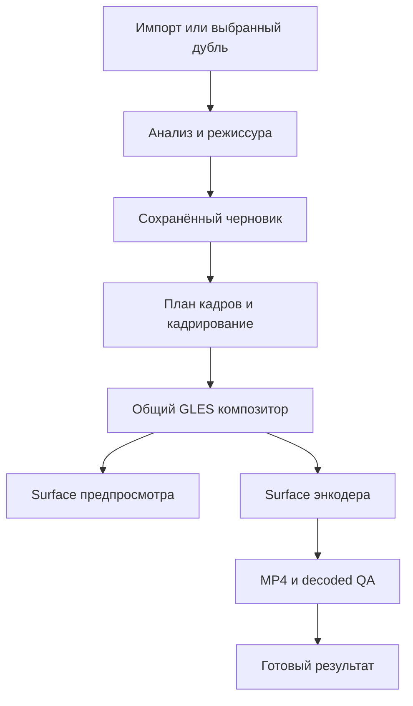

# Быстрый предпросмотр и выбор формата кадра в Veycad

Дата: 10 октября 2026 года. Статус: спецификация на согласовании.
Пользовательский сценарий согласован; реализация функций начинается после
ревью этой спецификации и отдельного плана работ.

## Цель и границы

Пользователь получает черновик автоматически собранного монтажа, смотрит его
с музыкой, перематывает свайпом, выбирает формат и исправляет кадрирование.
Полный MP4 создаётся после нажатия «Экспортировать». Финальный файл содержит
именно тот монтаж и ту композицию, которые пользователь просмотрел.

В первую версию входят четыре формата проекта, три режима кадрирования
исходника, воспроизведение и перемотка черновика, восстановление проекта и
экспорт выбранной версии. Это сценарий после автоматической режиссуры:
добавление дорожек, ручная перестановка склеек, редактор ключевых кадров,
выбор отдельного человека в группе и расширение поддержки HDR в него
не входят.

Первичный импорт, анализ материала и построение монтажа требуют времени.
Быстрый предпросмотр устраняет ожидание кодирования между оценкой монтажа
и изменениями формата; он не обещает мгновенный анализ любого исходника.
Разрешение предпросмотра снижает стоимость композиции на GPU. Декодирование
оригинального 4K при этом может оставаться дорогим.

## Текущая основа проекта

Основа спецификации — удалённая `main` на коммите
`a0395e26b93463f91520181a2eeb09dfd05e78a3`.
Пути Java/Kotlin остаются в каталоге `com/example/autoedit`, при этом
пакет приложения в этой версии — `com.veycad.app`.

| Область | Текущее поведение | Изменение |
| --- | --- | --- |
| [MainActivity](../../../app/src/main/java/com/example/autoedit/MainActivity.kt) | Запускает монтаж вместе с экспортом; `preparePreview` открывает готовый MP4 через `VideoView` | Добавить экран черновика между подготовкой и экспортом |
| [EditSession](../../../app/src/main/java/com/example/autoedit/EditSession.kt) | Хранит импортированные исходники и состояние полного рендера; `prepareCapture` после выбора дубля вызывает `render` | Разделить подготовку, просмотр и экспорт для импорта и съёмки |
| [VeycadAutomaticEditor](../../../app/src/main/java/com/example/autoedit/VeycadAutomaticEditor.kt) | Анализирует материал, строит граф, кодирует варианты, выполняет decoded QA и выбирает результат | Сохранить подготовленный граф до кодирования и экспортировать выбранный черновик |
| [MontageGraph](../../../app/src/main/java/com/example/autoedit/MontageGraph.kt) и [HighQualityFramePlan](../../../app/src/main/java/com/example/autoedit/HighQualityFramePlan.kt) | Содержат монтаж и расписание кадров с временем исходника, переходами, эффектами и индексом источника | Использовать один контракт для предпросмотра и экспорта |
| [MediaCodecSpeedRampRenderer](../../../app/src/main/java/com/example/autoedit/MediaCodecSpeedRampRenderer.kt) | GLES-композиция связана с Surface энкодера и muxer | Выделить общий композитор и два способа вывода |
| [SourceFraming](../../../app/src/main/java/com/example/autoedit/SourceFraming.kt) | Центральный crop учитывает ориентацию и pixel aspect ratio | Добавить положение crop, fit с фоном и дорожку автокадрирования |
| [RenderedVisualSampler](../../../app/src/main/java/com/example/autoedit/RenderedVisualSampler.kt) | Восстанавливает геометрию проверки через центральный crop | Проверять ту же композицию, которую применяет композитор |

Сейчас доступны Heartbeat, FEAR и DUALITY; Sigma заблокирована каталогом.
Новая архитектура должна уважать эту доступность. Общие интерфейсы могут
поддерживать другие графы, но продуктовый путь использует доступные рецепты.

Текущий выход — H.264/AVC и AAC-LC, 720p или 1080p. FEAR отдельно подменяет
высоту шириной и всегда экспортируется квадратным. Подмена должна уступить
явно выбранному формату проекта. [Текущий контракт медиа](../../SupportMatrix.md)

## Пользовательский сценарий

1. Пользователь импортирует материал или возвращается из камеры с выбранным
   либо рекомендованным дублем.
2. Приложение выполняет существующие проверки пригодности материала,
   анализ и режиссуру. Прогресс различает «Анализирую видео»,
   «Собираю монтаж» и, если необходимо, «Подготавливаю эффекты».
3. Открывается черновик с постером первого кадра. Воспроизведение запускается
   по нажатию. Экран показывает плеер, время, полосу с миниатюрами и
   отметками склеек, выбор формата, кадрирование и кнопку «Экспортировать».
4. Свайп по таймлайну меняет позицию на выходной шкале монтажа.
   Пользователь может последовательно просмотреть всю работу с музыкой.
5. Формат переключается без повторного поиска фрагментов. Кадрирование
   редактируется для выбранного исходника; в DUALITY есть переключение
   «Видео 1» и «Видео 2».
6. По кнопке «Экспортировать» пользователь выбирает качество и запускает
   рендер текущей версии. Экран прогресса относится к экспорту и его проверке.
7. После завершения открывается существующий экран готового результата,
   сохранение в галерею и библиотека «Эдиты».

Системный возврат из черновика сохраняет проект и возвращает к созданию.
Возврат из готового результата позволяет открыть связанный черновик.
Повторный запуск приложения восстанавливает последний сохранённый черновик
без автоматического экспорта. Готовые эдиты и черновик различаются статусом;
черновик не попадает в галерею как завершённое видео.

Визуальная основа — существующие экраны и
[согласованный экран создания](../../design/approved/create.png).
Полоса таймлайна прокручивается независимо от страницы.
Для доступности предусмотрены Play/Pause, переход к соседней склейке и
регулируемый ползунок времени с озвучиваемым значением.

## Форматы и качество экспорта

Формат — настройка конкретного проекта, качество — настройка экспорта.
Ориентация камеры не выбирает выходной формат автоматически.
Первоначальный формат для FEAR — 1:1, для Heartbeat и DUALITY — 9:16.
После явного выбора пользователя смена стиля сохраняет этот выбор.
Для каждого режима кадрирования параметры сохраняются отдельно по исходнику
и формату: переключение 9:16 → 16:9 → 9:16 восстанавливает прежнюю настройку.

| Формат | Назначение | 720p | 1080p | 4K при поддержке |
| --- | --- | --- | --- | --- |
| 9:16 | Stories и Reels | 720 × 1280 | 1080 × 1920 | 2160 × 3840 |
| 16:9 | Горизонтальное видео | 1280 × 720 | 1920 × 1080 | 3840 × 2160 |
| 1:1 | Квадрат | 720 × 720 | 1080 × 1080 | 2160 × 2160 |
| 4:5 | Лента | 720 × 900 | 1080 × 1350 | 2160 × 2700 |

В этой спецификации число в названии качества обозначает короткую сторону.
Для квадратного и 4:5 форматов подпись 4K сопровождается фактическими
размерами, чтобы пользователь видел выбранное разрешение.

До запуска проверяются возможности H.264-энкодера для точной пары
ширина/высота и FPS рецепта, alignment размеров и диапазон bitrate.
Размеры в таблице — желаемые; неподдерживаемая комбинация недоступна с
понятным объяснением. Приложение не округляет размер с искажением формата
и не снижает качество после старта без действия пользователя.
Поддержка декларацией кодека дополняется короткой локальной проверкой
запуска encoder Surface до публикации возможности 4K для этого устройства.
[Android VideoCapabilities](https://developer.android.com/reference/android/media/MediaCodecInfo.VideoCapabilities)

FPS и длительность задаются рецептом: существующий Heartbeat экспортируется
в 60 FPS, остальные доступные рецепты — в 30 FPS. Bitrate рассчитывается
по разрешению и FPS с ограничением возможностями кодека; текущие значения
720p и 1080p служат исходной настройкой качества, а не общим bitrate для 4K.
4K доступно только для комбинаций, прошедших проверку; возможность обычного
предпросмотра не означает возможность 4K-экспорта.

## Режимы кадрирования

Режим выбирается для исходника и применяется ко всем его вхождениям
в монтаже. У первой версии нет отдельных ручных настроек каждого клипа.
Первоначальный режим — «Вручную» с центральным crop и масштабом 1:
он воспроизводит существующее кадрирование. Для несовпадающих пропорций
на экране доступны все три режима.

| Режим | Поведение | Параметры |
| --- | --- | --- |
| Размытый фон | Передний слой целиком вписывается в проект; фон заполняется увеличенной и размытой копией того же кадра | Фиксированные параметры размытия первой версии |
| По человеку | Crop следует за устойчивым центром маски человека; окно ограничено исходником | Предварительно рассчитанная дорожка центра и статус достоверности |
| Вручную | Изображение заполняет кадр; пользователь двигает его и увеличивает pinch-жестом | Нормализованный центр и zoom от 1 до 3 |

Fit и crop сохраняют пропорции источника. В режиме размытого фона передний
слой содержит весь исходный кадр до применения художественных эффектов
рецепта. Передний слой и фон используют один source PTS; фон не отстаёт
от движения. При совпадении пропорций фон закрыт передним слоем и
дополнительное размытие можно не выполнять.

Ручной центр хранится в координатах ориентированного источника, в диапазоне
0…1. Zoom считается относительно минимального масштаба заполнения проекта.
Центр ограничивается так, чтобы crop не выходил за исходник. Кнопка
«Сбросить» возвращает центральное положение и zoom 1 для текущего исходника
и формата.

### Автоматическое кадрирование

Источник для движения окна — существующие маски сегментации в исходной
геометрии. Из надёжных семантических отсчётов рассчитываются взвешенный центр
и границы маски. При подготовке отбрасываются отсчёты с недостоверной маской,
перекрытием человека или резким скачком, который не подтверждают соседние
отсчёты. Дорожка фиксируется в микросекундах исходника и не зависит от
направления перемотки или FPS предпросмотра.

Центр сглаживается до начала просмотра. Между отсчётами используется
детерминированная интерполяция, а границы crop ограничиваются исходником.
Окно по возможности сохраняет голову и тело в доступной области;
узкий проект не гарантирует размещение целого человека без обрезки.

При потере надёжной маски до 500 мс сохраняется последний устойчивый центр.
Если потеря продолжается, центр за следующие 300 мс плавно возвращается
к середине исходника. При восстановлении надёжных отсчётов движение
возобновляется плавно за 300 мс. Эти интервалы оцениваются по source PTS;
на склейке между несмежными окнами исходника нет движения через пропущенный
участок. Установленный статус показывается кратко: «Человек не найден —
кадр по центру».

Для проверки неоднозначности семантические отсчёты расширяются числом
обнаруженных лиц и признаком успешного распознавания. Текущий
LocalSemanticFrameAnalyzer сохраняет только крупнейшее лицо; это поле
не позволяет определить, был ли человек один. Новые данные входят в версию
анализа и его кэша; отсутствующее значение означает «неизвестно», а не ноль.

Сегментация первой версии не выбирает личность в группе. Если анализ
показывает несколько лиц или неоднозначную маску, автокадрирование
не переключается произвольно между ними: используется центральный crop,
а пользователь получает доступ к ручному кадрированию и размытому фону.
Сообщение режима описывает фактическое ограничение.
Отсутствие детекции нескольких людей не считается доказательством
отслеживания конкретного человека.

## Общая архитектура

Выбран прямой вывод общей GLES-композиции на экран. Создание облегчённого
MP4 всего монтажа проще соединить с текущим VideoView, но снова требует
кодирования после изменения кадра. Отдельный плеер с собственной логикой
склеек повышает риск расхождений ускорений, переходов и масок.
Поэтому оба способа вывода используют единый монтаж и композитор.

Названия ниже обозначают проектируемые компоненты, а не уже существующие API.

| Компонент | Ответственность | Контракт |
| --- | --- | --- |
| Подготовка монтажа | Анализ, пригодность материала, режиссура, подготовка необходимых масок | Возвращает сохранённый черновик без encoder и muxer |
| Хранилище черновика | Атомарное хранение графа, источников, настроек и версии | Восстанавливает тот же монтаж по идентификатору проекта |
| План кадрирования | Вычисление fit/crop и центра по source PTS | Одинаковые нормализованные координаты для обоих выводов и QA |
| План кадров | Склейки, speed ramps, переходы, слои, эффекты и source PTS | Расширяет HighQualityFramePlan; не вводит второй алгоритм тайминга |
| Общий композитор | Декодированные текстуры, маски и GPU-проходы | Получает кадр и план композиции; рисует в заданный RenderTarget |
| Контроллер предпросмотра | Play/Pause, seek, музыка, lifecycle, кэш и отмена | Вывод на экран без создания выходного MP4 |
| Экспорт черновика | Фиксированный снимок проекта, encoder, muxer, decoded QA и публикация | Экспортирует ровно указанную версию |

Внутренний GlSession выделяется из MediaCodecSpeedRampRenderer с управлением
EGL, текстурами и проходами. Вывод в SurfaceView использует подходящую
EGL-конфигурацию экрана; вывод в encoder Surface учитывает
EGL_RECORDABLE_ANDROID. Encoder и muxer создаёт только путь экспорта.
MediaCodec остаётся декодером в обоих путях.
[Вывод MediaCodec на Surface](https://developer.android.com/reference/android/media/MediaCodec#using-an-output-surface)

### Порядок композиции и время

Порядок обработки: геометрия ориентированного исходника → кадрирование
источника → художественное преобразование клипа → двухисточниковый переход
и слои → эффекты и титры в координатах проекта → целевой Surface.
Для blur-режима foreground и background образуют одну композицию источника
до художественного преобразования клипа.

Поворот метаданных, pixel aspect ratio и преобразование SurfaceTexture
учитываются ровно в одной общей геометрии. Маска, depth, flow и face region
следуют преобразованию своего исходника. У DUALITY и любого перехода
данные привязаны к source ID и source PTS каждого слоя; данные первого
видео не применяются ко второму по совпадению времени.

Таймлайн пользователя содержит выходное время в микросекундах.
Общий план переводит его в source PTS через существующую speed ramp.
На переходах и временных слоях план выдаёт обе нужные позиции.
Просмотр не воспроизводит каждый исходник с постоянной скоростью и
не округляет склейки до ключевых кадров файла.

Размер предпросмотра меняет разрешение буферов. Все пространственные
параметры эффектов выражаются относительно проекта, чтобы blur, титры,
масштаб и положение сохраняли композицию при экспорте.
Разница детализации и плавности допустима; изменения порядка кадров,
эффектов, кадрирования и музыкальных акцентов недопустимы.

## Данные и восстановление черновика

Первая версия сохраняет один активный черновик. Новый черновик заменяет
предыдущий только после явного запуска нового монтажа пользователем и
успешного атомарного сохранения нового состояния.

Манифест содержит schemaVersion, projectId, возрастающую revision,
recipe ID и версию генератора, формат, исходники с устойчивыми ID и
отпечатками содержимого, выбранную музыку, граф монтажа, FPS рецепта,
настройки всех исходников по форматам и ссылки на семантические данные.
При съёмке сохраняются capture session ID и номер выбранного дубля.

Большие плоскости масок, depth и flow хранятся отдельно от компактного
манифеста в версионированном локальном кэше. Ключ семантического кэша
включает отпечаток исходника, SourceAnalysisProfile и версию анализа.
Ключи кадров предпросмотра дополнительно включают revision, формат,
кадрирование, output PTS и размер вывода. Формат не инвалидирует анализ
исходника, но инвалидирует кадры итоговой композиции.

Манифест обновляется через временный файл и атомарную замену. Параметры
во время жеста меняются в памяти, а окончание жеста фиксирует revision;
при уходе в фон последнее завершённое изменение сохраняется.
Копия на диске не должна ссылаться на частично записанный кэш.

Исходники импортированного черновика должны принадлежать проекту или
удерживаться по ссылкам хранилища. Текущая очистка sourceDraftDirectory
не может удалять файл, нужный сохранённому проекту или активному экспорту.
Съёмка удерживается через её существующее хранилище; новое хранение
не дублирует все дубли без необходимости.

Удаляемые миниатюры и буферы восстанавливаются. Если утеряны семантические
данные, необходимые для точного вывода, проект переходит в подготовку,
восстанавливает их и показывает новую версию черновика до экспорта.
Отсутствующий или изменённый исходник блокирует просмотр и экспорт
с предложением выбрать материал заново.
Граф будущей неподдерживаемой версии не преобразуется молча.

Старые готовые MP4 сохраняют существующий путь воспроизведения.
Связь с новым черновиком хранится в записи результата при наличии проекта;
для старого результата приложение не пытается восстановить монтаж из MP4.

## Быстрый предпросмотр и перемотка

Базовый размер вывода имеет короткую сторону 360 px:
360 × 640, 640 × 360, 360 × 360 или 360 × 450.
При достаточном запасе производительности можно поднять короткую сторону
до 540 px. Экспорт всегда получает полное выбранное разрешение и исходники.

Воспроизведение ориентируется на позицию музыки; до запуска audio clock
используется монотонное время. После seek музыка и видео получают одну
выходную позицию. Во время перетаскивания музыка приостановлена.
После отпускания показан точный кадр и восстановлено прежнее состояние:
пауза остаётся паузой, воспроизведение продолжается с новой позиции.

Предпросмотр выполняет до 30 показов в секунду. Для 60 FPS рецепта он
выбирает подмножество кадров общего расписания, сохраняя PTS и параметры
эффектов. Миниатюра или приблизительный кадр при активном свайпе явно
являются промежуточным ответом; после отпускания нужен точный кадр общей
выходной сетки, даже если он попадает между обычными показами предпросмотра.

Очередь seek хранит только последнюю запрошенную позицию. Каждый запрос
несёт поколение проекта, Surface и seek: устаревший callback не может
заменить новый кадр или снова включить звук. Отмена проверяется между
ограниченными операциями декодера; UI-поток не ожидает decode/EGL.
Перемотка назад и смена источника сбрасывают соответствующую позицию
декодера и восстанавливают состояние из общего плана.

При seek декодер начинает с предыдущего sync frame и проходит до требуемого
PTS. Первый кадр GOP не считается точным ответом на seek. Около позиции
просмотра поддерживается ограниченный кэш кадров и миниатюр; соседняя
склейка готовится заранее без накопления всех полноразмерных битмапов.

Для переходов разрешены максимум два активных видеодекодера.
Если нужная композиция требует дополнительных временных текстур,
они берутся из ограниченного кэша или готовятся последовательно.
Композиция с неполученным необходимым слоем показывает загрузку;
плеер не подменяет переход простой склейкой.

Суммарный дополнительный бюджет приложения для кэша предпросмотра,
миниатюр и FBO — 32 MiB. Внутренние буферы MediaCodec измеряются отдельно.
Рост памяти не зависит от длительности свайпа; кэш сбрасывается при
смене проекта, под давлением памяти и после закрытия просмотра.

Если GPU не успевает, сначала снижается размер вывода, затем пропускаются
показы при сохранении музыкального времени. Эффекты выбранного графа
не отключаются скрыто. Устойчивая нехватка производительности отображается
как состояние «Предпросмотр может идти рывками».
Подготовка перекодированных proxy-исходников с коротким GOP — отдельное
возможное улучшение после измерений, не условие появления черновика.

## Выбор варианта и совпадение с экспортом

У доступных рецептов сейчас один directed graph. Он становится черновиком
после необходимых проверок материала и подготовки масок.
Путь экспорта выбранного черновика не вызывает общий метод, который
повторно строит режиссуру и выбирает другой encoded candidate.

Уточнение масок, способное изменить композицию, завершается до состояния
готового черновика. Если позже появляются новые маски или меняется
версия генератора, создаётся новая revision, которую сначала показывают.
Оригинальный просмотренный граф не изменяется внутри экспортного задания.

Нажатие «Экспортировать» фиксирует revision, граф, семантические данные,
формат, кадрирование и профиль вывода. Повторное нажатие не создаёт
дублирующее задание. Во время экспорта редактирование заблокировано;
отмена после завершения очистки возвращает к той же версии черновика.

Decoded QA остаётся обязательной проверкой готового MP4.
При предупреждении результат показывает существующий явный статус качества.
QA может предложить вернуться к черновику, но не заменить граф,
кадрирование или выбранный дубль без действия пользователя.
Проверка контейнера, геометрии и семантических метрик использует фактические
параметры экспорта, включая выбранный формат и fit/crop.
Режим с размытым фоном проверяет человека в переднем слое; его копия в фоне
не должна искусственно улучшать показатели лица и маски.

Если новые форматы влияют на художественные элементы FEAR, Heartbeat или
DUALITY, адаптация производится по геометрии проекта: размещение титров,
масштаб эффектов и центры слоёв. Тайминг рецепта остаётся определён графом.
Каждый доступный рецепт проходит визуальное ревью во всех четырёх форматах.

## Состояния и ошибки

| Состояние | Действия пользователя | Переход |
| --- | --- | --- |
| Подготовка | Видеть текущий этап, отменить | Готовый черновик или ошибка подготовки |
| Готовый черновик | Смотреть, перематывать, менять формат и кадрирование, экспортировать | Изменённая revision или экспорт |
| Экспорт | Видеть прогресс, отменить до начала атомарной публикации | Тот же черновик или проверка результата |
| Проверка результата | Видеть прогресс QA, отменить до публикации | Результат или ошибка |
| Результат | Смотреть MP4, сохранить, поделиться, вернуться к черновику | Существующий результат или редактирование |

Ошибка отображается вместе с последним устойчивым состоянием.
Отмена подготовки сохраняет исходники и последний успешно записанный
черновик. Отмена экспорта удаляет только его временные файлы.
После начала атомарной публикации результат завершается согласно текущему
контракту EditSession; поздняя отмена не удаляет опубликованный файл.

При потере Surface и уходе приложения в фон просмотр останавливает звук,
освобождает декодеры и EGL и сохраняет позицию. После возвращения плеер
восстанавливает кадр в паузе. Активный экспорт остаётся работой EditSession
без ссылки на Activity. Завершение процесса прерывает экспорт с понятным
сообщением; исходники, черновик и прежние готовые эдиты остаются доступными.

Ошибка codec/GLES не выдаётся за отсутствие человека. Нехватка места
обрабатывается до создания длительного задания и при ошибке записи:
частичный MP4 не публикуется, а просмотренная версия проекта сохраняется.

## Целевые показатели

Следующие числа — требования к реализации, а не измеренные результаты.
Базовый стенд: физический Samsung SM-A256E и ещё одно ARM64-устройство
с 4 ГБ RAM. Материал: локальный H.264 SDR 1080p, 30/60 FPS, один или два
исходника, GOP до 2 секунд; монтаж обычной длительности доступных рецептов.
HEVC, длинный GOP и 4K проверяются отдельными профилями нагрузки.

| Показатель | Требование на базовом стенде |
| --- | --- |
| Первый точный кадр после завершения подготовки и готовности Surface | p95 ≤ 2 с |
| Визуальный ответ во время свайпа при попадании в кэш | p95 ≤ 100 мс |
| Точный кадр после последнего seek или отпускания свайпа | p95 ≤ 750 мс |
| Смена формата при наличии декодированного текущего кадра | p95 ≤ 150 мс |
| Play после готовности точного кадра | p95 ≤ 300 мс |
| Рассинхронизация музыки и видео в непрерывном просмотре | Не более 50 мс |
| Пропуски показов в предпросмотре 30 FPS | Не более 5% за полный просмотр |
| Точность output PTS остановленного кадра относительно общей сетки | Не хуже одного кадра экспорта |
| Дополнительные кэш, миниатюры и FBO | Не более 32 MiB |

Задержка первого кадра считается от состояния готового черновика и
готовой Surface до отображения требуемого кадра; длительность подготовки
измеряется отдельно. Seek считается от последнего запроса до показа
соответствующего точного кадра. Ответ с миниатюрой не завершает этот замер.
Audio drift считается по показанному output PTS и позиции audio clock,
а пропуски — относительно целевой сетки показов предпросмотра.

Для p95 собираются минимум 100 seek в обе стороны и 20 смен формата
на каждый базовый аппарат; для старта плеера — 20 повторов с раздельной
записью холодного и тёплого состояния. Кэш не прогревается искусственно
для холодного замера. Полный просмотр каждого доступного рецепта
повторяется три раза, затем выполняется 10 минут перемотки с контролем
RSS, Java heap и native/GPU memory. Отчёт содержит модель устройства,
Android, кодек, характеристики файла и версии проекта и приложения.

Невыполненная метрика остаётся открытым ограничением и блокирует заявление
о выполнении соответствующего критерия. Успешная сборка не заменяет
измерение интерактивности.

## Проверка и критерии приёмки

| Область | Обязательная проверка |
| --- | --- |
| Разделение подготовки и экспорта | Подготовка до открытия черновика не создаёт encoder, muxer или итоговый MP4 |
| Тайминг | Границы склеек, speed ramps, переходы и временные слои используют общий план; seek на обе стороны границы проверяется точными PTS |
| Геометрия | Четыре формата × три режима; исходники 16:9, 9:16, 4:3 и 1:1; повороты 0/90/180/270 и pixel aspect ratio |
| Два исходника | DUALITY с разной ориентацией и движущимся человеком в обоих источниках; независимые настройки и семантические данные |
| Автокадрирование | Движение в обе стороны, края кадра, временная потеря маски, несколько людей и восстановление; один PTS даёт один crop при любом порядке seek |
| Blur и manual | Полный передний слой и синхронный фон; ограничения центра/zoom; сброс и возврат прежних настроек после смены формата |
| Достоверность | Один и тот же сохранённый граф и crop для предпросмотра и MP4; QA не выбирает другой монтаж |
| Lifecycle | Recreation Activity, фон, перезапуск процесса, быстрые seek, смена формата и проекта; устаревшие callbacks не изменяют экран |
| Отказоустойчивость | Потеря Surface, недоступный codec, недостаток памяти и места, потерянный исходник, повреждённый кэш, неподдерживаемая schemaVersion |
| Экспорт | 720p и 1080p во всех форматах, поддерживаемые 4K-комбинации, точные размеры контейнера, длительность и A/V; отмена, повтор и атомарная публикация |
| Встроенная камера | Ручной выбор дубля и рекомендация открывают черновик; выбранный дубль совпадает с экспортом |
| Существующие функции | Сохранение, галерея, «Эдиты», воспроизведение старых MP4 и блокировка недоступных рецептов |

Автоматические проверки включают unit-тесты геометрии, временного плана,
версий и отмены; UI-тесты нового сценария; интеграционные проверки
декодеров, Surface и MP4. Для реализации выполняется
`./gradlew clean baselineVerify` и применимые Android UI-проверки
по [правилам проекта](../../../CONTRIBUTING.md).

На физических устройствах проверяются все доступные рецепты и четыре
формата. Предпросмотр и экспорт сравниваются в обычной скорости 1×
по склейкам, музыке, позиции человека, слоям и титрам; трудные переходы
дополнительно смотрят покадрово. На заранее выбранных PTS кадры общего
композитора в разрешении предпросмотра сравнивают с MP4 после приведения
к тому же размеру, учитывая потери H.264. Требуется совпадение композиции
и тайминга, а не побитовое равенство пикселей.

Готовность требует выполнения пользовательского сценария, измеримых
показателей базового профиля, корректного MP4 и человеческой визуальной
приёмки. 4K публикуется только для прошедших проверку сочетаний;
результаты непройденных устройств остаются в матрице ограничений.

## Порядок внедрения

Изменения разделяются на связанные этапы: общий контракт сохранённого
черновика и разделение подготовки/экспорта; единая геометрия формата и
трёх режимов кадрирования; общий композитор и контроллер предпросмотра;
продуктовый экран для импорта и камеры; проверка возможностей экспорта
и приёмка на устройствах. Это порядок зависимостей, не подробный
план реализации.

На переходном этапе существующий полный рендер сохраняется для
регрессионной проверки. Новый пользовательский путь включается целиком
после проверки предпросмотра и экспорта, чтобы не показывать работающий
плеер с неподдерживаемыми настройками.

Каждый этап получает отдельный связный коммит и PR с применимыми
проверками и ограничениями. Непринятый результат публикуется как draft.
Слияние требует явного решения владельца. Следующий артефакт после
согласования спецификации — подробный план реализации.
